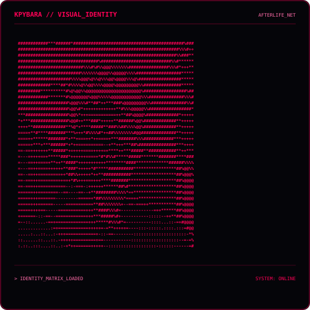

 

 

<pre>
╔══════════════════════════════════════════════════════════════╗
║                                                              ║
║                 K P Y B A R A   //   N E T                  ║
║                                                              ║
║                  AFTERLIFE_NETWORK                           ║
║                                                              ║
║              CONNECTION ESTABLISHED                          ║
║                                                              ║
╚══════════════════════════════════════════════════════════════╝
</pre>

 

## `kpybara@afterlife ~ $ whoami`

<table>
<tr>

<td width="50%" align="center">

</td>

<td width="50%" align="center">

</td>

</tr>
</table>

 

---

## `kpybara@afterlife ~ $ cat /etc/profile`

<pre>
┌─────────────────────────────────────────────────────────────┐
│ IDENTITY                                                    │
├─────────────────────────────────────────────────────────────┤
│                                                             │
│ NAME        João Victor                                     │
│ USER        @KpyBara                                        │
│ SYSTEM      ONLINE                                          │
│ EDUCATION   ADS @ IFPA                                      │
│ LOCATION    BRAZIL                                          │
│ EDITOR      VS CODE                                         │
│                                                             │
└─────────────────────────────────────────────────────────────┘
</pre>

> Desenvolvedor em formação, estudante de **Análise e Desenvolvimento de Sistemas no IFPA**, explorando desenvolvimento web, programação, hardware e redes.

---

## `kpybara@afterlife ~ $ ./contributions.sh`

 

---

## `kpybara@afterlife ~ $ ls /skills`

| SYSTEM | STATUS |
|:---:|:---:|
| `HTML` | `ONLINE` |
| `CSS` | `ONLINE` |
| `JAVASCRIPT` | `ONLINE` |
| `PYTHON` | `ONLINE` |
| `GIT` | `ONLINE` |
| `NETWORKING` | `LOADING...` |
| `HARDWARE` | `ONLINE` |

 

---

## `kpybara@afterlife ~ $ cat current_focus`

<pre>
&gt; WEB DEVELOPMENT
&gt; PROGRAMMING
&gt; HARDWARE
&gt; NETWORKING
&gt; LEARNING BY BUILDING
</pre>

Meu foco atual é transformar conhecimento teórico em projetos funcionais, experimentando diferentes tecnologias e aprendendo principalmente através da prática.

---

## `kpybara@afterlife ~ $ neofetch`

<pre>
                    ███████████████
                 ███               ███
               ██       KPYBARA       ██
              ██                       ██
             ██     ▄▄▄▄▄▄▄▄▄▄▄▄▄      ██
             ██    █             █     ██
             ██    █   AFTERLIFE  █     ██
             ██    █      NET     █     ██
              ██   █             █    ██
               ██   ▀▀▀▀▀▀▀▀▀▀▀▀▀   ██
                 ███             ███
                    ███████████████

OS:          Windows / Pop!_OS
EDITOR:      VS Code
SHELL:       Bash / PowerShell
LANGUAGES:   JavaScript / Python
WEB:         HTML / CSS
VCS:         Git / GitHub
STATUS:      Learning...
</pre>

---

## `kpybara@afterlife ~ $ ./system_status`

<pre>
[████████████████████████████████] 100%

IDENTITY              ONLINE
GITHUB NETWORK        ONLINE
WEB DEVELOPMENT       ONLINE
PROGRAMMING           ONLINE
HARDWARE              ONLINE
NETWORKING            ONLINE

SYSTEM STATUS:        OPERATIONAL
</pre>

---

## `kpybara@afterlife ~ $ exit`

<pre>
╔══════════════════════════════════════════════════════════════╗
║                                                              ║
║       CONNECTION TERMINATED — AFTERLIFE_NET                 ║
║                                                              ║
║              SEE YOU ON THE NEXT RUN                         ║
║                                                              ║
╚══════════════════════════════════════════════════════════════╝
</pre>

 

