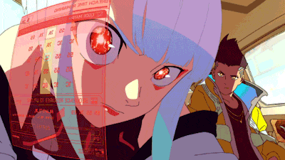

 

 

---

### `CURRENT_FOCUS`

`WEB DEVELOPMENT`
`PROGRAMMING`
`HARDWARE`
`NETWORKING`

 

---

### `STACK`

`HTML` · `CSS` · `JAVASCRIPT` · `PYTHON` · `GIT`

 

---

`KPYBARA@AFTERLIFE_NET`
`CONNECTION ESTABLISHED // SYSTEM ONLINE`

